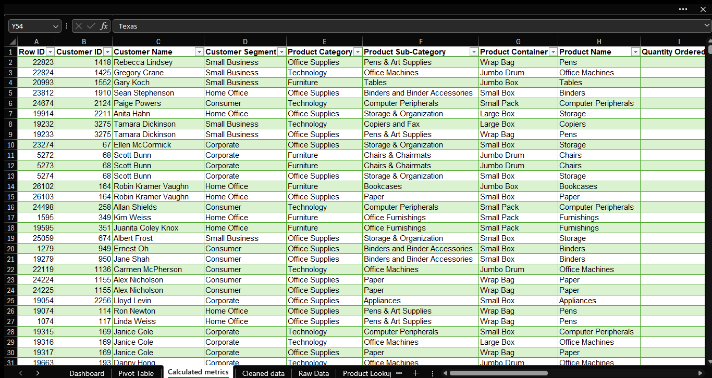
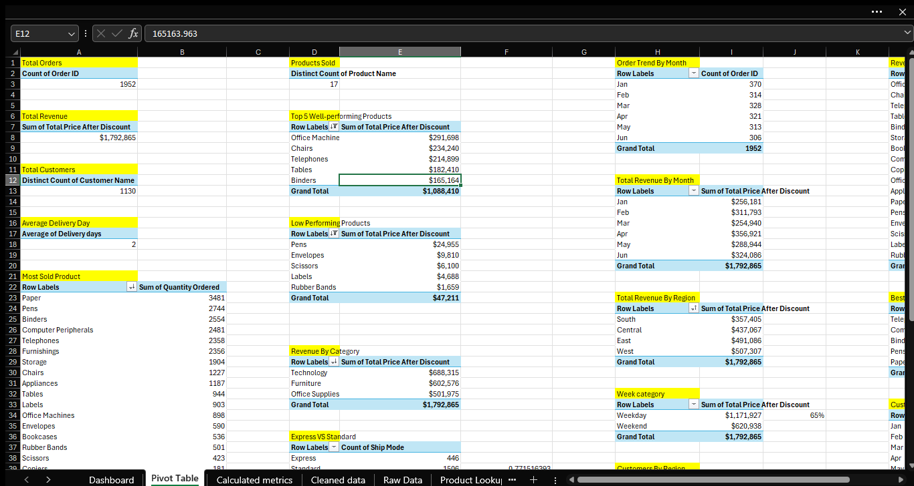
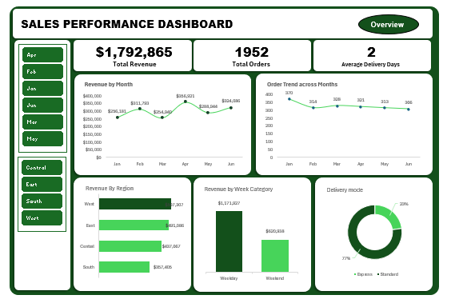
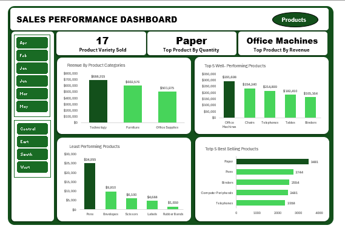
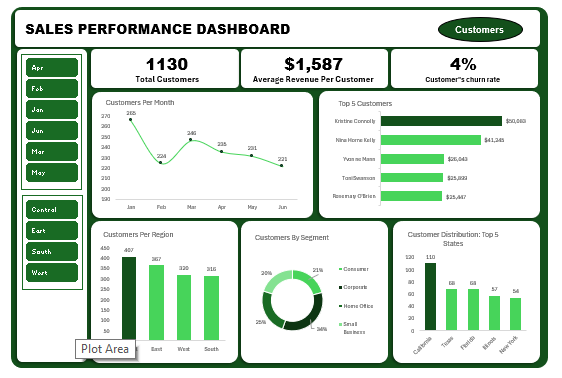

# TRENDY-PICKS-SALES-PERFORMANCE-ANALYSIS

## Introduction
Trendy Picks is a fast-growing commercial supplies mart in the United States. As business continues to expand, understanding sales performance, customer preference and product demand has become essential for sustainable growth.
This project focuses on analyzing 6 months of transactional dates (Jan 2015 – Jun 2015) to create an interactive dashboard that supports strategic decision making for profitability and customers’ satisfaction.

## Problem Statement
Trendy Picks is expanding in the global market and need to get hold of their business such as understanding the sales trend across the months, product performance, analyze customers’ distribution pattern and customer churn rate, in order to up scale the brand in the global market. The aim of this project was to analyze and design user-friendly dashboards to answer key questions and support informed decisions.

## Data Sourcing
**Source**: Trendy Picks sales dataset, comprising of 3 worksheets which include raw data, product lookup and customer lookup.

**Time Period**: January – June 20215
  - Raw data: 1960 records & 26 fields
  - Product lookup: 17 records & 2 fields
  - Customer lookup: 1952 records & 2 fields

**Key Fields**:
  - Customer ID
  - Customer Name
  - Customer Segment
  - Product Name
  - Product Sub-category
  - Product Category
  - Quantity
  - Unit Price 
  - Discount
  - Ship Mode
  - Order Date
  - Ship Date
  - State or Province
  - Region

## Data Transformation & Cleaning
**Microsoft Excel** was used for the data cleaning. The following steps were taken;
  - Understood the given data
  - Created a copy of the raw data
  - Removed blank rows & columns
  - Added the Customers’ name and products’ name to the dataset using Vlookup & Xlookup
  - Arranged the fields for better understanding
  - Standardized the necessary fields
  - Changed data type for order date and ship date fields
  - Created calculated columns for more insights
  - Created Pivot tables
  - Lastly, created dashboards for data visualization
        
*View The Cleaned Dataset Below*

*View Pivot Tables Below*

## Analytics & Calculated Columns
The Key Calculated Columns were created to monitor trends;
  1. Total Sales Before Discount =[@[Quantity Ordered]]*[@[Unit Price]]
  2. Discount Amount =[@Discount]*[@[Total Price Before Discount]]
  3. Total Sales After Discount =[@[Total Price Before Discount]]-[@[Discount Amount]]
  4. Order Month =TEXT([@[Order Date]],"mmm")
  5. Order Week Category =IF(WEEKDAY(S53,2)>5,"Weekend","Weekday")
  6. Delivery Days  =[@[Ship Date]]-[@[Order Date]]

## Dashboards & Visuals
The dashboards were segmented into 3; Overview, Customers and Products for clear insights and understanding.
The dashboard includes:

KPI Cards:

*Overview*: 
  - Total Revenue
  - Total Orders
  - Average Delivery Days
    
*Customers*:
  - Total Customers
  - Average Revenue Per Customer
  - Customers’ Churn Rate
    
*Products*:
  - Product Variety Sold
  - Top Product By Quantity
  - Top Product By Revenue
    
Line Charts:
  - Revenue By Month
  - Order Trend Across Months
  - Customers Per Month
    
Column Charts:
  - Revenue By Week Category
  - Revenue By Product Category
  - Top 5 Well-performing Products
  - Least Performing Products
  - Customers Per Region
  - Customers Distribution – Top 5 States
    
Bar Charts:
  - Revenue By Region
  - Top 5 Best Selling Products
  - Top 5 Customers
    
Pie Charts:
  - Delivery Mode
  - Customers By Segment
    
Slicers:
  - Months
  - Regions

**_View Sales Overview Dashboard Below_**

**_View Products Overview Dashboard Below_**

**_View Customers Overview Dashboard Below_**

## Insights & Findings
Trendy Picks generated a total revenue of **_$1,792,865_** within a six-month period. During this time, the business recorded **_1,952 orders_** from **_1,130 customers_**, offering **_17 different product varieties_**. The average delivery time for orders was **_two days_**.

In terms of monthly performance, **April** generated the highest revenue, *$356,921*, followed by June, $324,086 and February, $311,793. A key factor contributing to this performance was the strong sales of office machines and telephones, which have relatively higher selling prices compared to other products.

Analysis of the sales period shows that **65%**, *$1,171,927* of the total revenue was generated during weekdays. Additionally, the Western and Eastern regions recorded the highest revenue, indicating stronger customer demand and market activity in these areas.

The overall customer churn rate during the period was approximately **_4%_**. However, a significant proportion of orders were generated by first-time customers, indicating that the business relies heavily on new customer acquisition rather than repeat purchases. As a result, limited repeat purchasing behavior made it difficult to identify specific drivers of churn within the dataset.

From a product perspective, **Paper** accounted for the highest number of products sold, *3,481* during the period. However, **Office machines** generated the highest revenue, *$291,698*, mainly due to their higher profit margins and selling prices.

Analysis further shows that the monthly order trend is closely aligned with the customer trend. Months with increased customer activity recorded higher order volumes, indicating a strong relationship between customer participation and total orders generated.

Finally, it was observed that the number of orders was not directly proportional to the revenue generated across the months. This suggests that revenue growth was influenced more by high-value products than by the volume of orders alone.

## Recommendations
  1. Marketing strategies should be put in place especially in months with less revenue generated.
  2. Customer reviews should be encouraged.
  3. Promotions should be encouraged in provinces with least customers.
  4. Profit field should be created on the data, so as to calculate the profit margin across the months.
  5. Low performing products such as rubber band should be discontinued, if monitored and the result is consistent.
  6. Gift /discount offers should be given to Top customers and as well to returning customers to build customer base.

## Conclusion
This dashboard equips Trendy Picks with data-driven intelligence needed to strengthen sales strategies, improve customer satisfaction, and support sustainable business expansion. By leveraging these insights, the business is better positioned to make informed decisions, enhance profitability, and maintain competitive relevance within the market.
Future improvement may include dataset from different years to analyze and compare sales trend over the years.

## Author
**Nwali Adaobi**
**(Data Analyst)**
